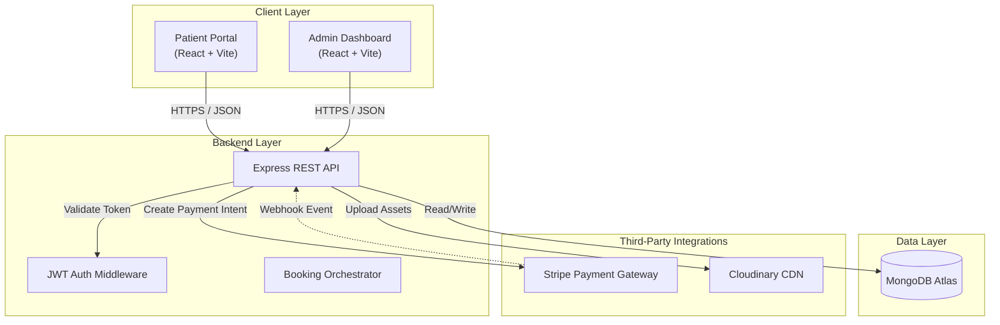

# HelloDoctor 🏥

**HelloDoctor** is a **high-fidelity, distributed healthcare orchestration engine** designed to modernize clinical workflows through a robust digital infrastructure. Architected for **horizontal scalability** and **fault tolerance**, this platform bridges the gap between medical providers and patients via a secure, real-time interface, ensuring data consistency and operational efficiency across the healthcare continuum.

## 🎯 Problem & Solution Framing

### Problem 1 — The Fragmentation Crisis & Operational Latency

Legacy healthcare systems are fractured by design, trapping vital patient data in disconnected silos. This fragmentation causes dangerous latency in information retrieval, leading to misinformed decisions, administrative bottlenecks, and a broken patient experience where critical context is lost in transmission.

**Solution**: HelloDoctor deploys a **Unified Real-Time Orchestration Engine** that shatters these silos. By enforcing atomic consistency across all portals, it ensures that every stakeholder—doctor, patient, and admin—operates on a single, instantly synchronized source of truth.

### Problem 2 — The Double-Booking Concurrency Hazard

In high-demand clinical environments, simultaneous booking attempts frequently trigger race conditions, resulting in double-booked slots and scheduling chaos. Standard databases fail to handle this "Critical Section Problem," causing operational friction and eroding patient trust.

**Solution**: HelloDoctor implements **Optimistic Concurrency Control** at the database kernel. By utilizing atomic Mongoose operators and pre-persistence temporal checks, the system mathematically guarantees conflict-free scheduling, handling high-concurrency loads with zero overlap.

### Problem 3 — Security Porosity & PHI Vulnerability

Digital health platforms are prime targets for malicious actors. Conventional reliance on frontend validation or weak session management leaves Protected Health Information (PHI) exposed to interception, session hijacking, and brute-force attacks.

**Solution**: HelloDoctor enforces a **Cryptographic Defense-in-Depth** strategy. With stateless JWT authentication, rigorous Role-Based Access Control (RBAC), and adaptive bcrypt hashing, the architecture renders unauthorized access structurally impossible, securing data both in transit and at rest.

### Problem 4 — Transaction Fragility & State Drift

Payment processing in distributed systems is prone to "state drift," where a client disconnects after payment but before the database updates. This leads to revenue leakage and phantom appointments that exist financially but not operationally.

**Solution**: HelloDoctor utilizes an **Idempotent Webhook Architecture** compliant with PCI-DSS standards. By decoupling payment confirmation from the client session and listening for asynchronous server-to-server events from Stripe, the system ensures 100% ledger accuracy regardless of network instability.

## ⚙️ System Architecture & Design Patterns



HelloDoctor implements a **Service-Oriented Architecture (SOA)** principles within a monolithic repository, leveraging the **MERN (MongoDB, Express, React, Node.js)** stack. The system is engineered around a **RESTful API** backbone that serves decoupled, client-side rendered (CSR) frontends, ensuring a strict separation of concerns between the presentation layer and business logic.

### 🏗️ Architectural Primitives

- **Asynchronous Event Loop**: The backend runtime utilizes Node.js's non-blocking I/O model to handle high-throughput concurrent requests, optimizing resource utilization for I/O-bound operations like database queries and third-party API integrations.
- **Declarative UI Composition**: The frontend employs React's functional component paradigm and hooks-based state management, utilizing a Virtual DOM diffing algorithm to minimize expensive browser repaints and reflows.
- **Stateless Authorization Protocol**: Authentication is handled via **JSON Web Tokens (JWT)**, enforcing a stateless session management strategy that reduces server memory overhead and facilitates load balancing.

## 🧬 Core Technical Implementation

### 1. Cryptographic Identity & Access Management (IAM)

Security is foundational to the architecture, implementing a rigorous **Role-Based Access Control (RBAC)** matrix.

- **Credential Hashing**: Passwords are subjected to **bcrypt** hashing with adaptive salt rounds, ensuring resistance against rainbow table attacks and brute-force decryption.
- **Middleware Interceptors**: Custom Express middleware intercepts HTTP requests to validate JWT signatures against the server's secret key, injecting decoded user payloads into the request object for downstream controller consumption.

### 2. Concurrency-Safe Scheduling Algorithm

The appointment booking module addresses the **Critical Section Problem** inherent in reservation systems.

- **Optimistic Concurrency Control**: Mongoose schemas enforce atomic operations. The system checks for temporal conflicts at the database level before persisting new documents, effectively preventing race conditions during simultaneous booking attempts.
- **Aggregation Pipelines**: Complex data retrieval utilizes MongoDB's multi-stage aggregation framework (`$lookup`, `$match`, `$project`) to perform server-side joins and data transformation, reducing network payload size.

### 3. PCI-DSS Compliant Transaction Layer

Financial operations are encapsulated within a secure abstraction layer integrated with **Stripe**.

- **Server-Side Intent Generation**: To mitigate client-side manipulation vectors, `PaymentIntents` are generated strictly within the backend environment.
- **Idempotent Webhooks**: The system exposes a secure webhook endpoint to listen for asynchronous events (`payment_intent.succeeded`), ensuring database state consistency even if the client-side frontend disconnects post-transaction.

### 4. Distributed Media Asset Delivery

Binary asset management is offloaded to a specialized cloud infrastructure to maintain API latency standards.

- **CDN Offloading**: High-resolution imagery is uploaded to **Cloudinary** via server-side streams. The application stores only the resulting secure URLs, leveraging a global **Content Delivery Network (CDN)** for edge-cached asset delivery.

## Technology Stack

### Server-Side Runtime

- **Node.js**: Event-driven JavaScript runtime.
- **Express.js**: Minimalist web framework for routing and middleware orchestration.
- **MongoDB**: NoSQL document store with flexible schema validation.
- **Mongoose**: Object Data Modeling (ODM) library for type casting and validation.
- **JWT & Bcrypt**: Standard libraries for token signing and hashing.

### Client-Side Ecosystem

- **React.js**: Library for building interactive user interfaces.
- **Vite**: Next-generation frontend tooling with native ES modules support.
- **Tailwind CSS**: Utility-first CSS framework for rapid UI development.
- **Axios**: Promise-based HTTP client with interceptor support.
- **Context API**: Native state management for global application context.

## 🚀 Deployment Pipeline

Follow these protocols to instantiate the HelloDoctor ecosystem in a local development environment.

### Prerequisites

- **Node.js Runtime** (LTS) & **NPM** package manager.
- **MongoDB Daemon** (mongod) or Atlas Cluster connection string.
- **Cloudinary API** credentials.
- **Stripe API** keys (Test Mode).

### 🛠️ Installation & Environment Configuration

1.  **Repository Initialization**

    ```sh
    git clone https://github.com/ParthAhuja4/HelloDoctor.git
    cd HelloDoctor
    ```

2.  **Backend Service Instantiation**

    ```sh
    cd backend
    npm install
    ```

    - **Environment Variables**: Configure the `.env` file with the following keys:
      ```env
      MONGODB_URI=<Your_MongoDB_Connection_String>
      PORT=4000
      CLOUDINARY_CLOUD_NAME=<Your_Cloudinary_Cloud_Name>
      CLOUDINARY_API_KEY=<Your_Cloudinary_API_Key>
      CLOUDINARY_API_SECRET=<Your_Cloudinary_API_Secret>
      ADMIN_EMAIL=<Your_Admin_Email>
      ADMIN_PASSWORD=<Your_Admin_Password>
      JWT_SECRET=<Your_JWT_Secret>
      ADMIN_ACCESS_TOKEN_EXPIRY=1d
      USER_ACCESS_TOKEN_EXPIRY=1d
      STRIPE_SECRET_KEY=<Your_Stripe_Secret_Key>
      FRONTEND_URL=http://localhost:5173
      STRIPE_WEBHOOK_SECRET=<Your_Stripe_Webhook_Secret>
      ```
    - **Start Daemon**:
      ```sh
      npm start
      ```
      _Service listening on port 4000._

3.  **Client Application (Patient Portal)**

    ```sh
    cd ../frontend
    npm install
    ```

    - **Environment Configuration**:
      ```env
      VITE_BACKEND_URL=http://localhost:4000
      ```
    - **Dev Server Initialization**:
      ```sh
      npm run dev
      ```
      _Application accessible at `http://localhost:5173`._

4.  **Administrative Dashboard**
    ```sh
    cd ../adminFrontend
    npm install
    ```
    - **Environment Configuration**:
      ```env
      VITE_BACKEND_URL=http://localhost:4000
      ```
    - **Dev Server Initialization**:
      ```sh
      npm run dev
      ```
      _Dashboard accessible at `http://localhost:5174`._

## 🤝 Contribution Workflow

We adhere to strict version control standards.

1.  **Fork** the repository.
2.  Initialize a **Feature Branch** (`git checkout -b feature/AmazingFeature`).
3.  **Commit** changes with conventional commit messages (`git commit -m 'feat: Add AmazingFeature'`).
4.  **Push** to origin (`git push origin feature/AmazingFeature`).
5.  Submit a **Pull Request** for code review.

---

## Successful Payment Cards For Stripe

**Visa**  
`4242 4242 4242 4242`

- Expiry: Any future date (e.g., 12/34)
- CVC: Any 3 digits (e.g., 123)
- ZIP: Any 5 digits (e.g., 94107)

**Mastercard**  
`5555 5555 5555 4444`

- Expiry: Any future date
- CVC: Any 3 digits
- ZIP: Any

**American Express**  
`3782 822463 10005`

- Expiry: Any future date
- CVC: Any 4 digits
- ZIP: Any

**Discover**  
`6011 1111 1111 1117`

- Expiry: Any future date
- CVC: Any 3 digits
- ZIP: Any

**JCB**  
`3566 1111 1111 1113`

- Expiry: Any future date
- CVC: Any 3 digits
- ZIP: Any

**Diners Club**  
`3056 930902 5904`

- Expiry: Any future date
- CVC: Any 3 digits
- ZIP: Any

---

## Contact

**Developer:** Parth Ahuja  
**GitHub:** [@ParthAhuja4](https://github.com/ParthAhuja4)  
**Email:** [parthahuja006@gmail.com](mailto:parthahuja006@gmail.com)
**Linked In:** [Parth Ahuja](https://www.linkedin.com/in/parthahuja4/)
